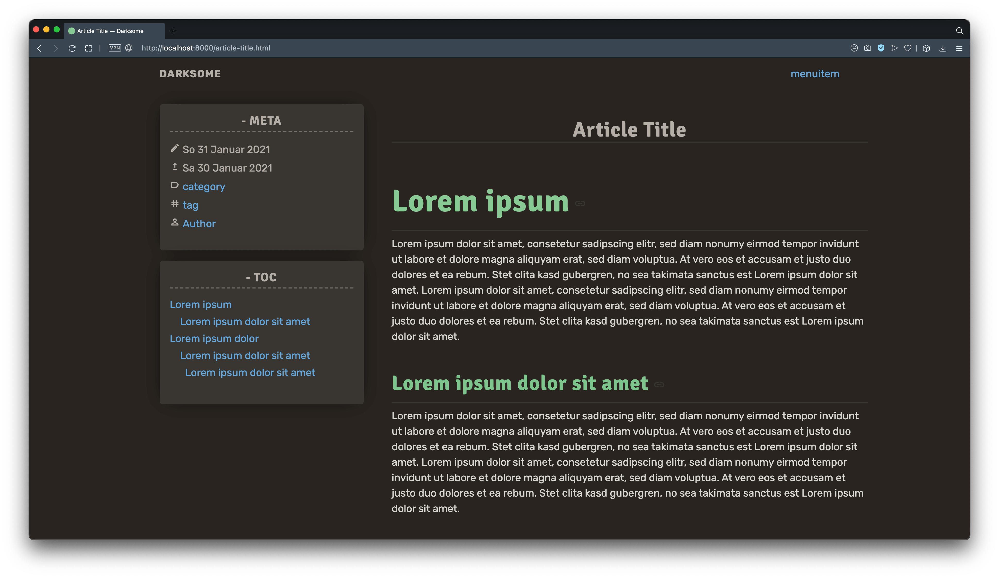

= Pelican Theme Darksome
:toc:
:toc-placement!:

See https://davidwolf.dev[live example]

toc::[]

== Settings
Available settings for `pelicanconf.py`:

[source, python]
----
"""theme specific settings below 👇"""

from datetime import date

FOOTERTEXT = 'Copyright © 12019 - {0}'.format(date.today().year + 10000) # human era

"""links displayed in page footer"""
FOOTERITEMS = (
    ('legal', 'legal/'), # title, link (SITEURL will be added automaticly)
    ('privacy', 'privacy/'),
)

"""not used on index"""
TITLE_SEPARATOR = '-' # Title - Site Name

MEDIA = {
    'logo': 'media/images/logo.svg',
    'favicon': 'media/images/favicon.svg',
    'background': 'media/images/background.webp', # on home
}

"""used wherever articles are listed"""
TRANSLATIONS = {
    'en': {
        'flag': '🇬🇧'
    },
    'de': {
        'flag': '🇩🇪'
    },
}
----

== Frontmatter
Available frontmatter options in content files:

[source, asciidoc]
----
// <meta name="robots" content="noindex">
:noindex: true

// <meta name="description" content="">
// article previews on list pages
:description: description
----
